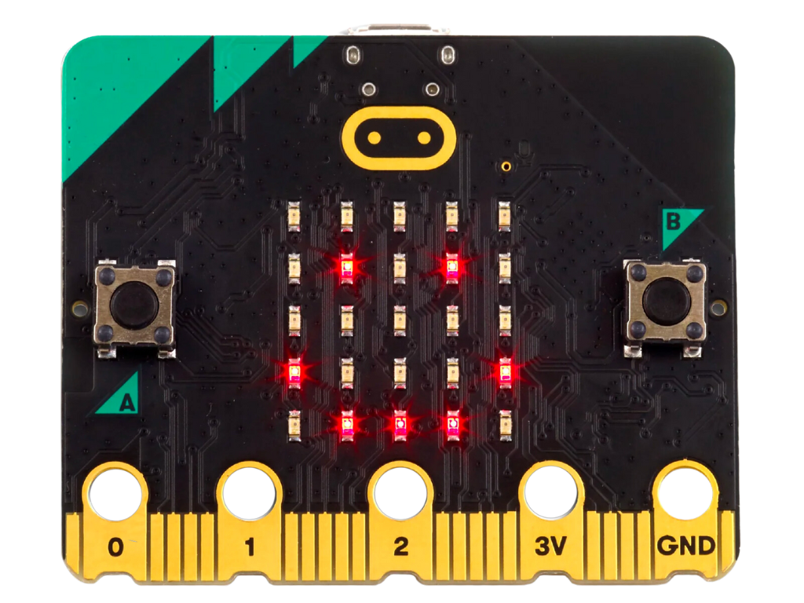
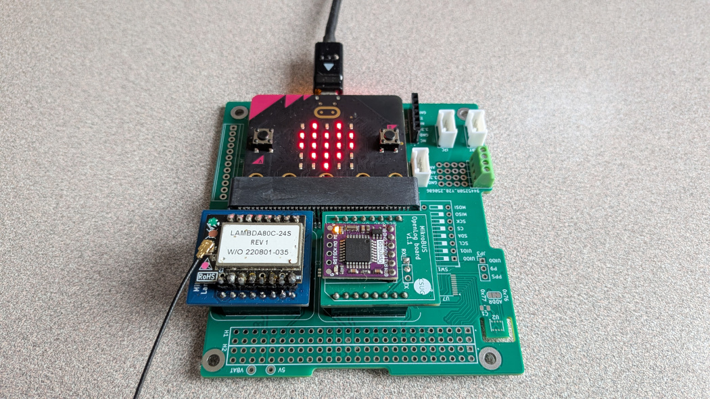
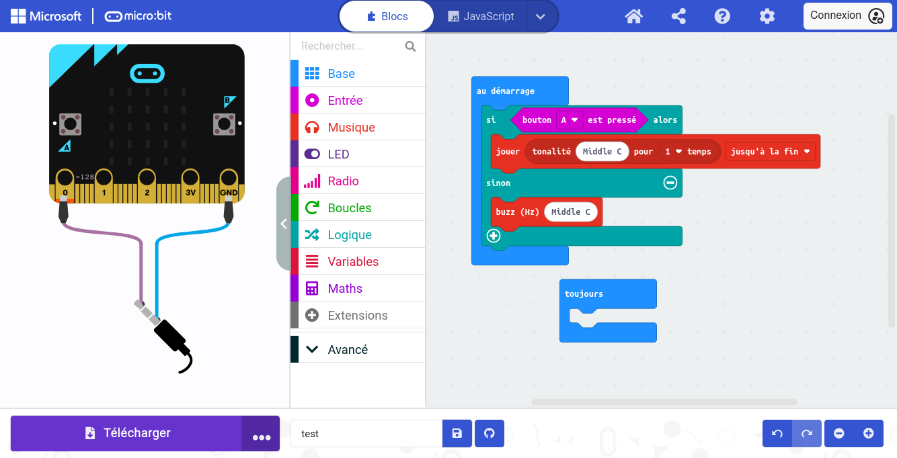

`\newpage{}`{=latex}

# Abstract

This report presents a project conducted by a 4th-year computer science master students at Polytech Grenoble, aimed at designing an educational Internet of Things (IoT) introductory kit for middle school students. The goal was to develop hands-on lab materials and a MakeCode extension to simplify the use of various sensors (thermometer, GPS, LoRa) within a weather balloon simulation, all based on the Micro:bit v2 board. While this approach led to the completion of some deliverables (basic tests, thermometer), the project faced significant technical and organizational challenges, including shifting requirements, missing sensors, and frequent GPS module reboots. Consequently, this document details the technical work performed and the project management strategy adopted, while also providing an assessment of the obstacles that prevented the full completion of the weather station and LoRa communication for the weather balloon.

`\newpage{}`{=latex}

## Glossary

- **Micro:bit V2**: Microcontroller board realised by the BBC. Its goal is to facilitate IoT learning for teenagers. Many different interfaces are implemented for it. Their role is to abstract and simplify the functionning of the board.



- **SEED board**: Expansion board that allows various additional sensors to be connected to the Micro:Bit. Abstractions to simplify its usage are not already implemented.



- **MakeCode**: One of the interfaces compatible with the Micro:Bit. It offers a simplified coding interface, as well as a block coding interface.

- **Block interface / No-code interface**: This interface represents functions and variables as blocks. To code with them, the user can plug them like puzzle pieces. The result is a more visual code, with a lessened syntax barrier.



`\newpage{}`{=latex}

# Introduction

This project is a final 4th-year project for computer science engineering students at Polytech Grenoble. It lasted two months and took place alongside other courses. One or two afternoons were allocated to it every week. The project is therefore set within an educational yet realistic context, with the aim of creating a situation representative of a corporate project.

Our subject involves creating an educational kit for teaching IoT (Internet of Things) in middle school. We are therefore targeting a level suitable for middle school students, with a pedagogical objective. The result is intended for middle school teachers, who can use it for their practical work classes.

This project is supervised by Mr. Didier DONSEZ. He also represents the client, his needs, and requirements in the roles of Project Owner (PO, or MOA in french) and Project Manager (PM, or MOE in french). The development team consists of two students, Robin COURAULT and Sophie HAUGUEL. The development team is also responsible of the management of the project. After several weeks, we established contact with a potential user, an interested teacher, Mrs. Christel HARDY. At the same time, Mr. Sébastien JEAN identified himself as a facilitator for our communications with Mrs. HARDY.


This educational kit contains a `Micro:bit V2` board that is plugged into the `SEED` expansion board. It aims to offer a block interface for middle schoolers to use the sensors of the `SEED` board. This was done by extending the `MakeCode` interface, although it might not be the most suitable interface for our potential user. Anyhow, the students could use the additional sensors to create a weather balloon.

Thus, the subject identifies two expected deliverables:  
- A practical work subject (TP in french) for teachers and middle schoolers
- An extension for the `MakeCode` no-code programming interface.

In addition, deliverables inherent to the educational context are also expected, such as this report or the defense.

The development of the project faced many challenges, to say the least. The initial specifications had to be revised and simplified, for reasons that we will develop later on. The end goal of making a weather ballon was compromised, and we instead focused on the discovery and usage of new sensors.

As a result, we implemented a `MakeCode` extension with blocks to use GPS coordinates. This includes a minimap, that enables easy and visual testing. To accompany it, we wrote a practical work subject. It focuses on trying out each sensor, and introduces the weather ballon, with corrections.

This description ultimately serves to fulfill the need to introduce middle schoolers to the Internet of Things (IoT).

`\newpage{}`{=latex}

# Project Management

> Where to find the ressources:
>
> - on github : <https://github.com/Robin-Courault/pxt-kit-pedagogique-iot-meteo/tree/main>
>   - check each branch

Project management focused on the following objectives:

- performing the bulk of the work during the sessions specifically reserved in the schedule
- ensuring all parts of the project are mastered by the entire team
- leveling up the team's skills to ensure everyone reaches a common level of proficiency.

## Management Methods

For project management, we chose to follow an agile method based on an iterative cycle. Throughout the project, parts of the deliverables were regularly deployable. Additionally, we integrated our potential client into the project process, too late though. However, our project owner was integrated from the start and remained so throughout the project.

Each work session began with a short meeting regarding the work from the previous session, a brief recap of the remaining work, and then the distribution of tasks for the session. As a general rule, members who had a task to finish continued their work. In other cases, everyone chose what they wanted from the remaining tasks. It also frequently happened that one team member would ask another to continue or take over their work to provide a fresh perspective.

This organization allowed us to guarantee our objectives of global project mastery and skills leveling, as each part of the project could progress and develop skills on the task of their choice. The project team's excellent motivation allowed this method to work during the first few weeks of the project; however, as the project progressed, team motivation decreased, and it was only the will to finish that maintained the functionality of this organizational method. The small size of the team also contributed to the success of this approach.

All remaining work was managed using the `Jira` tool, allowing us to maintain tracking of the various tasks and sub-tasks to be completed. We chose `Jira` because one team member was already familiar with the tool, and it provided a board for tasks and sub-tasks as well as an ordered schedule similar to a Gantt chart. In hindsight, the tool was far too heavy. It requires too many ressources from the computer to load it, was time-consuming to learn and offered too many management options for our needs. Choosing a simpler, lighter tool would have been more relevant.

## Risks Analysis & Planning

Below is the Gantt chart for our project. As represented, the initial plan had to be changed following the many setbacks we faced—notably the absence of certain modules initially planned or the lack of time to perform certain tasks. It was instead replaced by the revised plan.


Among the changes we made, we gave up on the humidity and pressure part of the subject. Unlike we planned, we didn't receive the sensor necessary. But we realised this after writing down the subject, and left these parts although no blocks were implemented related to that.

The implementation of `LoRa` was cancelled primarily due to a lack of time. Furthemore, members of another group, more specialized than us in embedded electronics, failed to make `LoRa` work on the `Micro:bit` despite having more time, expertise, and human resources. 

The part concerning the weather balloon was cancelled mainly due to lack of time but also as a consequence of other cancellations: a weather balloon only capable of measuring temperature and locating itself is not truly complete.

**Risks identified at the start:**

- **A.** Late arrival of the board => **Acceptance**: this is a significant risk, but one we cannot really do anything about in the context of this project. This would prevent us from testing both the board and the modules. However, we were familiar with the board before receiving it.
- **B.** Late arrival of the modules => **Reduction**: a high risk as it prevents creating drivers (as we had no idea of the model for some modules) and testing. We reduced the impact by anticipating the design so as not to delay the entire project if the risk became a certainty.
- **C.** Imprecise project objectives and definition => **Reduction** (of impact): by integrating regular validations and revisions of the specifications into the organization. If realized, this risk can cause major changes and waste time by forcing us to discard completed work.
- **D.** Excessive hardware and development constraints => **Acceptance**: risk of poor choices to fit constraints and overly complex development. Accepted because it was something we had no decision-making power over.
- **E.** Team's lack of skills => **Acceptance** (Provisioning): this is a risk accepted by choosing to reserve time for skill building.


**Re-evaluation of risks at the end of the project and new risks:**

- **F.** Final user constraints diverging from constraints given by the project owner and manager => **Avoidance** (or at least **Reduction**) by communicating more with and further integrating the final users (in this case, Christel HARDY) into the project.
- **G.** Module not functioning on our board (Micro:bit) => **Avoidance** by changing the module or the board. Or by removing this module from the specifications in the worst-case scenario. Or **Reduction** by selecting a board with better support and hardware libraries.
- **H.** Non-arrival of planned modules => **Acceptance** because there is little chance of this happening, but very problematic as it potentially wastes time by discarding work already performed.


As can be seen, several risks unforeseen at the start of the project proved critical when realized. The problem was that they occurred without us having anticipated mitigation strategies. Three of the five initial risks proved more impactful than expected, which also worked to our detriment.

## Financial Assessment

This project was carried out with limited resources, though they were sufficient except the time. We had:

- 2 laptops
- 2 Micro:bit V2
- 1 XA1110 GPS module
- 2 LoRa transceivers, Wio-SX1262
- 2 students (Robin COURAULT & Sophie HAUGUEL) for approximately 50 hours each, totaling about one hundred work hours.

`\newpage{}`{=latex}

# Technical Work

## Specifications

The needs analysis proved to be complex due to our main contact's busy schedule. The specifications (cahier des charges) were difficult to define and stabilize. After a first version based on the short project description, we produced a second version by discussing it with Mr. DONSEZ, then adjusted it throughout the project as we progressed and asked questions. We couldn't manage to validate the second version of the specifications. It was through questions and discussions that we refined the requirements.

Thus, the practical work assignment was described in our specifications as being:  

- independent of other resources, 
- intended for users already familiar with the `Micro:bit V2`,
- covering each new module useful for the weather balloon, 
- required to be in `Markdown` format. 

To suit middle school students, we agreed on a rather short format for each part of our practical work assignment, with each part consisting of:

- short explanations regarding its objective and context;
- manipulation instructions, requiring exploration and understanding;
- a correction of the manipulations and short explanations;
- an optional discovery lesson to explain the relevance of the section toward building a weather balloon.

To cover all the modules necessary for the weather balloon while maintaining a logical and pedagogical sequence, we chose to define the following sections in the subject:

- Introduction
- Launch test (checking if the board works)
- Exploration of the modules with:
  - Thermometer
  - Accelerometer
  - Pressure sensor
  - Humidity sensor
  - GPS
  - LoRa Transmitter/Receiver
- Development of the program for the weather balloon, also allowing for the consolidation of acquired knowledge.

In the second specifications, we only kept the thermometer, accelerometer and GPS modules in the exploration part.

## Tools used

Considering the development environments, `VSCode` and `neovim` were employed. This difference did not cause any problem as the online `Playground` interface from `Microsoft MakeCode` was also used extensively. It most notably allows to test code effects and functionality on the `MakeCode` interface and the `Micro:bit` board. We tried other local comilation tools, such as a local installation of `MakeCode` or `mkc`. This `Playground` interface is also useful for development as it includes an editor with `TypeScript` auto-completion, as well as for libraries specific to `MakeCode` and the `Micro:bit`. Both were a loss of time, as documentation was rare and over-summarised. 

To continue, we used `Git` and specifically `GitHub`. `GitHub` was required for the creation of a `Microsoft MakeCode` extension. `MakeCode` itself was the coding interface imposed by our project manager and owner, Mr. DONSEZ. Using `MakeCode` also dictated the use of the `TypeScript` language to write the extension, as it is the only truly accepted language. There exists methods for using `C++` in MakeCode, which are very poorly documented.

Moving on to hardware, regarding the board and various sensors, we had to work with the `Micro:bit V2`. But the board lacked libraries for utilizing all the hardware modules we were given. This means that we had to implement the drivers ourselves, making the project best fit for electronic students. However, the board has the advantages of being inexpensive (~€20). It is also specifically designed for middle school students, and goes along the `MakeCode` interface. For the sensors and transmitters, given the number of existing modules and the time we had, we appreciated not having to choose them ourselves. Their technical documentation was quite accessible.

## Instructions Sheet

> See branch `sujet`, file `sujet/sujet.md`.

We wrote the subject in iterations, each time refining it a bit more. With a skeleton first, containing titles only. Then a short sentence describing the upcoming contents. In the final stage, each part was written by completing the previously defined skeleton. An introduction was also added to present the final goal of the project: the development of a program for a sounding balloon or weather balloon. For each part, the first step was to introduce the section with a short sentence, such as: `To ensure everything is properly installed, let's start with a quick test:`. We then wrote the manipulation instructions to be as concise, explicit, and precise as possible, for example:

```md
Try to make the LED blink.

    It should turn on for 500ms, turn off for 500ms, then repeat indefinitely.
```

Following the instructions, a small lesson section explains the importance of the sensor in the context of a weather balloon. This lesson part required research, but there was no need to be exhaustive; its purpose was only to provide the broad outlines of the sensor's utility. We supplemented this with a short link redirecting to explanatory pages from Météo-France, so that interested students could find more information or an alternative explanation.

Finally, the drafting of the parts concluded with the correction elements. They were first built and tested on the MakeCode interface and then integrated as screenshots at the end of the subject. We put them in a separate section titled `Corrections`, so that the teacher can easily cut them out if they prefer.

In total, 4 parts were written: `Thermometer`, `Pressure`, `Humidity`, and `GPS`, the latter not being completely finished as a short lesson is potentially missing. Furthermore, these parts do not all have a correction and are not necessarily implemented at the MakeCode extension level, due to the sensor blocks coding complications.

## Code

> See branch `code`, file `main.ts`.
> The `//%` annotations in the code are used by MakeCode to generate blocks and categories in the interface.

### Blocks

> It should be noted that we are only describing here the methods and functions usable via the MakeCode interface in the form of blocks. We are not considering the additional code necessary to make them functional.

We defined what the blocks should be for each sensor, including those we did not implement in the end. It includes a data retrieval for every module. The pressure sensor also included a `setPressureRange` to adapt the precision to the coder's needs. We also considered adding `onChange` blocks for some sensors. It would have allowed event-based programming with the blocks.

Here is a description of the blocks we planned for GPS and LoRa sensors, as these are more complex.

#### GPS

- `getLocation` block: allows the current location to be retrieved in the form of an object consisting of two elements; this block aimed to introduce students to the world of the object-oriented paradigm while providing a simple way to retrieve a meaningful location.
- `getLocationElement` block: allowing the retrieval of the longitude or latitude of a `Location` object using a block that lets the user select one or the other value via a dropdown list.

We then chose to add several additional blocks to add interaction to the project. These allow students to visually see the location evolve, enabling them to test the GPS. We will see the implementation in more detail in the [Map library](#map-library) section. Of course, these blocks are not intended for use in the actual weather balloon:

- `createMap` block: allowing the construction of a `Map` object; this object can be seen as an aggregate of `Location` objects converted into flat coordinates. The `Map` object aims to allow the display of `Locations` more simply for students using the Micro:bit's 5x5 LED screen.
- `addLocation` block: allowing a `Location` to be added to a `Map`.
- `clearMap` block: allowing all points in a `Map` to be deleted.
- `setAnchor` block: allowing the anchor point used to display the `Map` to be redefined from a `Location` (without adding the `Location` to the Map points).
- `moveAnchor` block: allowing the anchor point to be redefined by providing an offset in grid cells from the current anchor point.
- `setCellSize` block: allowing the size of the `Map` cells to be redefined; when at least 1 point is located in a cell, it is lit up.

#### LoRa

- `sendMsg` block: allowing a LoRa message to be sent on a specific constant frequency.
- `sendMsgFreq` block: allowing a LoRa message to be sent on a given frequency.
- `receiveMsg` block: allowing a LoRa message to be received on a specific constant frequency (the same as the `sendMsg` block).
- `receiveMsgFreq` block: allowing a LoRa message to be received on a given frequency.
- `onReceiveMsg` block: an event block executing its code when a message is received.

This set of blocks would have allowed us, in our opinion, to do pretty much whatever we wanted with LoRa. However, according to the group of students working on the same board as us, the LoRa transmitter was unusable on a Micro:bit. In any case, we would not have had the time to complete this part.

### Map library

The `Map` library we built contains all the blocks accessible on the MakeCode interface as well as all the functions and objects necessary for their operation.

Initially, we have two enumerated types: `anchorPositionType`, which corresponds to the position of the anchor point on the display (center, top-left corner, top-right corner, bottom-left corner, and bottom-right corner), and `sizeUnitType`, which corresponds to a distance unit (meter or kilometer).

```ts
export enum anchorPositionType {
    //% block="Center"
    anchorCenter,
    //% block="Top left corner"
    anchorTopLeft,
    //% block="Top right corner"
    anchorTopRight,
    //% block="Bottom left corner"
    anchorBottomLeft,
    //% block="Bottom right corner"
    anchorBottomRight
}

export enum sizeUnitType {
    //% block="m"
    m,
    //% block="km"
    km
}
```

We therefore have a `Map` object (below), carrying information about its anchor point, the size of its cells, its points, the display size, and the pixels to turn on during display. This last field avoids allocating a new array in memory for every display update.
The constructor takes a cell size and a unit as parameters; the `Map` retrieves the current position to use as the initial anchor point and defines it as the center of the display.

```ts
export class Map {
        anchor_m : Point2D; // in meters
        anchorPosition : anchorPositionType;
        cellSize_m : number; // in meters
        points : Point2D[];
        printSize : number = 5;
        pixelsToTurnOn : boolean[][];

        constructor(
            cellSize : number,
            sizeUnit : sizeUnitType
            ) {
                this.anchor_m = (inputSeed.getLocation()).toPoint2D();
                this.anchorPosition = anchorPositionType.anchorCenter;
                if (sizeUnit == sizeUnitType.m) {
                    // sets the size in meters
                    this.cellSize_m = cellSize;
                } else {
                    // converts the size to meters
                    this.cellSize_m = cellSize*1000;
                }
                this.points = [];
        }
        ...
```

However, to simply allow the creation of `Map` objects, a helper function `newMap` will be used as a block in MakeCode. The first annotation defines the block text, the second the name of the variable to be populated with the constructed object, and the last defines the default value for the `cellSize` parameter. The other two annotations are only for the visual behavior of the block.

```ts
//% block="new Map centered on current location || and cells measuring $cellSize $sizeUnit"
//% blockSetVariable=map
//% inlineInputMode=external
//% expandableArgumentMode="toggle"
//% cellSize.defl=1
export function newMap(cellSize : number, sizeUnit : sizeUnitType) {
    return new Map(cellSize, sizeUnit);
}
```

In a `Map`, we do not store a `Location` directly but rather `Point2D` objects; these also have 2 numerical values, but they do not have the same meaning and correspond to flat coordinates in meters.

```ts
export class Point2D {
    x : number;
    y : number;

    constructor(x : number, y : number) {
        this.x = x;
        this.y = y;
    }
}
```

These objects are constructed from a `Location` using the latter's `toPoint2D()` method, which handles the conversion. This responsibility could have belonged to the `Point2D` objects, but it also seemed entirely consistent to us that another object should implement its own conversion since it is best placed to know its own structure.

```ts
//Formula found on : https://gis.stackexchange.com/a/488625
// Returns the equivalent flat coordinates (in 2D meters)
// The y axis grows from south to north
// The x axis grows from west to east
toPoint2D(): map.Point2D {
    const lat_rad: number = degToRad(this.latDeg);

    const x_m: number = this.lonDeg * 111111 * Math.cos(lat_rad);
    const y_m: number = this.latDeg * 111111;

    return new map.Point2D(x_m, y_m);
}
```

Regarding the simple blocks for using the `Map` object, the code is self-explanatory, so here it is below:

```ts
//% block="Set $anchor as anchor on $position for $this"
//% this.defl=map
setAnchor(anchor : inputSeed.Location, position : anchorPositionType) {
    this.anchor_m = anchor.toPoint2D();
    this.anchorPosition = position;
}

//% block="Move $anchor of $this of $nCellsAbscisse cells in x and $nCellsOrdonnee cells in y"
//% this.defl=map
moveAnchor(nCellsAbscisse : number, nCellsOrdonnee : number) {
    this.anchor_m.x += nCellsAbscisse*this.cellSize_m;
    this.anchor_m.y += nCellsOrdonnee*this.cellSize_m;
}

//% block="Set cell size of $this to $cellSize $sizeUnit"
//% this.defl=map
setCellSize(cellSize : number, sizeUnit : sizeUnitType) {
    this.cellSize_m = (sizeUnit == sizeUnitType.m) ? cellSize : cellSize*1000;
}

//% block="Add $location to $this"
//% this.defl=map
addLocation(location : inputSeed.Location) {
    this.points.push(location.toPoint2D());
}

//% block="Remove all locations in $this"
//% this.defl=map
clear() {
    this.points = [];
}
```

As for the display block (`print`), we will not cover all of its code as it is quite long. The general idea is as follows:

- Reset the array of pixels to be lit.
- Define a top boundary value and a left boundary value based on the display position and the anchor point coordinates.
- Set the anchor point pixel as one to be displayed, even if it is not part of the `Map` points.
- Iterate through the `Map` points within the defined boundaries and note the pixels to be displayed.
- Convert the array of pixels to be displayed into a character string according to the format expected by the MakeCode standard library function for lighting an LED array.
- Display the portion of the `Map` by lighting the LEDs.

### GPS library

The GPS module library includes functions for retrieving sentences from the module, parsing them, and extracting longitude and latitude values, as well as module configuration and basic blocks for MakeCode.

Let's start with the blocks involving the `Location` object; since the object's structure is self-descriptive, let's continue with obtaining a new object of this type.

```ts
export class Location {
    latDeg: number; // in degrees
    lonDeg: number; // in degrees

    constructor(latitude : number, longitude : number) {
        this.latDeg = latitude;
        this.lonDeg = longitude;
    }
    ...
```

Obtaining a new `Location` involves retrieving the last current location. The choice was made to have a regular background loop responsible for retrieving sentences from the module and extracting the latest location to avoid saturating the I2C buffer connecting the module to our board, thus preventing a GPS module reset.

```ts
//% block="retrieve current location"
//% blockSetVariable=location
//% group="GPS"
export function getLocation(): Location {
    return lastLocation;
}
```

We will discuss the regular loop later; first, let's talk about the last block accessible from the outside: the `getLocationElement` method, which simply returns one or the other field of a given `Location` object in the block, depending on the `typeVal` parameter which corresponds to the `locationType` enumeration.

```ts
export enum locationType {
    //% block="Longitude"
    locationLon,
    //% block="Latitude"
    locationLat
}
```

```ts
//% block="get $typeVal of $this"
//% group="GPS"
//% this.defl=location
getLocationElement(typeVal: locationType): number {
    if (typeVal === locationType.locationLat) {
        return this.latDeg;
    } else if (typeVal === locationType.locationLon) {
        return this.lonDeg;
    } else {
        return NaN;
    }
}
```

Returning to the regular loop (called every 200ms in the background) mentioned earlier: it retrieves all sentences—that is, it retrieves all raw data available from the GPS module and extracts complete sentences. The loop then iterates through each sentence, splitting it to isolate each field, removing the checksum, and then processing it. Processing consists of attempting to read a `GGA` sentence; if no location is found, it attempts to read an `MTK` sentence; otherwise, it defines the last location as the one just retrieved.

```ts
loops.everyInterval(200, function () {
    let trames = inputSeed.getAllTrames();

    for (let i = 0; i < trames.length - 1; i++) {
        if (trames[i].trim().length > 0) {
            let parts = trames[i].trim().split('*')[0].split(',');
            let tempLoc = inputSeed.parseTrameGGA(parts);

            if (tempLoc != null) {
                inputSeed.setLastLoc(tempLoc);
            } else {
                inputSeed.checkTrameMTK(parts);
            }
        }
    }
});
```

This loop retrieves all sentences via `getAllTrames()`. This function retrieves all available raw data and adds it to the buffer containing the last incomplete sentence. Then, the function splits the set of sentences into an array and keeps the last sentence because it is incomplete; note that if the last sentence is complete, the last element of the sentence array will contain an empty string.

```ts
export function getAllTrames(): string[] {
    let raw = readRawData();
    if (raw.length === 0) return [];

    trameBuffer += raw;

    // Processing complete phrases
    let lines = trameBuffer.split(""); // caractère de saut de ligne mais compilateur md to pdf ne veut pas donc retiré, see main.ts

    // Keep the last incomplete line in the buffer
    trameBuffer = lines[lines.length - 1];

    return lines;
}
```

The retrieval of raw data is done by reading a maximum of 32 bytes from the GPS module's address. For each byte, it checks if it is a printable character or one of the two end-of-line characters; if so, it adds it to the result returned at the end.

> Note that subsequently, we will have two '\\n' at each line end, which will create empty array elements in `getAllTrames()` during splitting; however, this is not a problem as an empty element is ignored in the regular loop.

```ts
function readRawData(): string {
    let result = "";
    try {
        // Reading bytes from the module
        let data = pins.i2cReadBuffer(GPS_ADDRESS, 32, false);

        for (let i = 0; i < data.length; i++) {
            let charCode = data.getNumber(NumberFormat.UInt8LE, i);
            // Filter valid characters (printable ASCII)
            if (charCode >= 32 && charCode <= 126) {
                result += String.fromCharCode(charCode);
            } 
            // CR + LF
            else if (charCode === 13 || charCode === 10) {
                result += ""; // caractère de saut de ligne mais compilateur md to pdf ne veut pas donc retiré, see main.ts
            }
        }
    } catch (e) {
        result = "";
    }
    return result;
}
```

Regarding the analysis of GGA sentences, the code is quite simple: we check the value of the first field to ensure it is a GGA sentence, verify that we have a GPS fix, and then retrieve the longitude and latitude by converting them into a single decimal value each, avoiding the format that includes time and cardinal direction. We then return a `Location` object created with the retrieved longitude and latitude values.

```ts
const GGA_LAT_POS = 2;
const GGA_LON_POS = 4;
const GGA_FIX_GPS_POS = 6;
export function parseTrameGGA(trame : string[]): Location | null {
    // GP = GPS | GN = GPS + GLONASS
    if (trame[0] == "$GPGGA" || trame[0] == "$GNGGA") {
        // if FIXGPS (= positioning type) = 0 then no position fix,
        // we would preferably like GPS (=1) but fundamentally as long as it's fixed, it suits us.
        if (parseFloat(trame[GGA_FIX_GPS_POS]) > 0) {
            let lat = nmeaToDegrees(trame[GGA_LAT_POS], trame[GGA_LAT_POS+1]);
            let lon = nmeaToDegrees(trame[GGA_LON_POS], trame[GGA_LON_POS+1]);

            return new Location(lat, lon);
        } else {
            return null;
        }
    } else {
        return null;
    }
}
```

For the processing of MTK sentences, we check the prefix and then remove it. In the case where we have a system message, we look at its meaning; if it indicates the end of startup, we define the sentences we wish to receive—in this case, only GGA.

```ts
const MTK_INIT_CMD = "$PMTK314,0,0,0,1,0,0,0,0,0,0,0,0,0,0,0,0,0,0,0*29\r"; // + caractère de saut de ligne mais compilateur md to pdf ne veut pas donc retiré, see main.ts
let isStarted : boolean = false;
export function checkTrameMTK(trame : string[]): boolean {
    if (trame[0].substr(0,5) == "$PMTK") {
        switch (trame[0].substr(5)) {
            case "010": // sys_msg
                // msg = startup ended
                if (trame[1] == "002" && !isStarted) {
                    // setup the sending of GGA sentences
                    let buf = pins.createBuffer(MTK_INIT_CMD.length);
                    for (let i = 0; i < MTK_INIT_CMD.length; i++) {
                        buf.setNumber(NumberFormat.UInt8LE, i, MTK_INIT_CMD.charCodeAt(i));
                    }
                    pins.i2cWriteBuffer(GPS_ADDRESS, buf, false);
                    isStarted = true;
                }
                break;
            case "001": // ack
                // we do not handle the acknowledgment of our initialization
                if (trame[1] == "314" && trame[2] == "3") {}
            default:
                break;
        }
        return true;
    } else {
        return false;
    }
}
```

There we go; thanks to all of this, the GPS module has what it needs to function. However, we encountered a problem: the module keeps resetting (restarting its startup procedure) without us knowing why, despite numerous attempts and research.

`\newpage{}`{=latex}

# Conclusion

To finally conclude this report, let us start by recalling that nothing went as planned. The practical work subject initially contained 7 parts (excluding the introduction). But only five (`Launch Test`, `Thermometer`, `Humidity Sensor`, `Pressure Sensor`, and `GPS`) were mostly finalized. Among these five, two are truly complete (the `Launch Test` and `Thermometer` sections). Regarding the `MakeCode` extension, only the GPS module has functional blocks. The other sensors were either not received and `LoRa` was not implemented despite research to begin developing the driver and blocks. Furthermore, the GPS module blocks are partially functional but unusable because of the GPS module's resets. This report is perhaps the only thing that proceeded smoothly and thus stands as a witness to the difficulties encountered.

On the other hand, this troubleshooting made this project very educational for us. It taught us the importance of having a proper risk analysis, to avoid facing unforeseen problems or those exceeding the measures taken. Planning effective mitigation strategies would have lessened the time lost. This concern should have been more present in our daily meetings. Clearly setting a time or effort limit before changing the strategy would be a great way to do that.

Next, regarding organization, we decided to maintain a global understanding of the project across the entire team. This means taking the time so that everyone can learn all the tools used. However, regarding the time constraint, it is now certain that we should have assigned the tasks to already-competent team members. The time spared could then have been invested into tasks where the whole team needed to upskill. The time allocation could therefore have been better.

Our project manager told us to use pre-existing libraries to speed up our work. Unfortunately, the lack of turnkey libraries for the `Micro:Bit` actually complicated our work. We wasted our time trying to use libraries when they were not designed for our board and developed in a language difficult to use on the `MakeCode` tool. This taught us that it is sometimes simpler to rewrite a basic library rather than repurposing one from its original use.

But even then, the lack of expertise in embedded electronics was still a major complication. In particular, concerning the exploring and understanding of the components' documentation. But also in our research, given the time constraints, a significant background of knowledge and skills was necessary.

Distinguishing between the expectations of the client and those of the end-users was also an important learning point. Since we discovered that the teacher was using a tool other than `MakeCode` only three weeks before the project deadline. This is our fault, as we assumed the client perfectly knew the user's needs, which is in truth rarely the case. 

Finally, to conclude our learning experiences, the lack of various choices in this project was a real bottleneck for the team. Given our skills, choosing the board, components, or languages could have allowed us to reduce the impact of our lack of expertise in embedded electronics, as well as the colossal amount of time required for the project.

Let us close by discussing what remains to be done and the future possibilities our project offers. First, there are various parts of the subject to complete, as well as the GPS (to be finished) and LoRa (to be implemented) sections in the `MakeCode` extension. The modules we did not receive (humidity sensor and pressure sensor) could also be added. Regarding the project's future, it is important to question the choice of the `Micro:Bit` board for this project, as well as the `MakeCode` interface, which is relatively incompatible with the languages most commonly used in embedded systems, namely `C++` and `Python`.

`\newpage{}`{=latex}

# Bibliography

> Made with <https://www.scribbr.fr> or manually when scribbr didn't work.

- Extension localization files. (s. d.). Microsoft. <https://makecode.com/extensions/localization>
- Naming Conventions. (s. d.). Microsoft. <https://makecode.com/extensions/naming-conventions>
- MakeCode Languages: Blocks, Static TypeScript and Static Python. (s. d.). Microsoft. <https://makecode.com/language>
- Auto-generation of library files. (s. d.). Microsoft. <https://makecode.com/simshim>
- Defining Blocks. (s. d.). Microsoft. <https://makecode.com/defining-blocks>
- Building your own extension. (s. d.). Microsoft. <https://makecode.com/extensions/getting-started>
- Micro:bit MakeCode extensions. (s. d.). Microsoft. <https://makecode.com/extensions/approval>
- micro : bit MakeCode extensions. (s. d.). Help & Support. <https://support.microbit.org/support/solutions/articles/19000054952-package-approval>
- microsoft. (s. d.-b). pxt-sonar/main.ts at master · microsoft/pxt-sonar. GitHub. <https://github.com/microsoft/pxt-sonar/blob/master/main.ts>
- BBC micro:bit overview. (s. d.). <https://microbit.org/get-started/features/overview/>
- Edge Connector and Pinout. (s. d.). <https://tech.microbit.org/hardware/edgeconnector/>
- Micro:Bit Hardware. (s. d.). <https://tech.microbit.org/hardware/>
- CampusIoT. (s. d.). tutorial/microbit at master · CampusIoT/tutorial. GitHub. <https://github.com/CampusIoT/tutorial/tree/master/microbit>
- Sparkfun. (s. d.). GitHub - sparkfun/SparkFun_I2C_GPS_Arduino_Library : Library for reading and controlling MT3333 and MT3339 based GPS modules over I2C. GitHub. <https://github.com/sparkfun/SparkFun_I2C_GPS_Arduino_Library/tree/master>
- How can I code in C++ using the micro : bit. (s. d.). Help & Support. <https://support.microbit.org/support/solutions/articles/19000017961-how-can-i-code-in-c-using-the-micro-bit>
- NWCPP - Northwest C++ Users Group. (2018, 19 avril). Microsoft MakeCode : from C++  to TypeScript and Blockly (and Back) [Vidéo]. YouTube. <https://www.youtube.com/watch?v=tGhhV2kfJ-w>
- microsoft. (s. d.). GitHub - microsoft/pxt-microbit : A Blocks / JavaScript code editor for the micro : bit built on Microsoft MakeCode. GitHub. <https://github.com/microsoft/pxt-microbit>
- Understanding the Compilation and Linking Process in PXT-Microbit MakeCode : From Blocks to Hex File. (2024, 13 novembre). Microsoft MakeCode. <https://forum.makecode.com/t/understanding-the-compilation-and-linking-process-in-pxt-microbit-makecode-from-blocks-to-hex-file/31682>
- WIO-SX1262 Introduction | Seeed Studio Wiki. (2024, 12 octobre). <https://wiki.seeedstudio.com/wio_sx1262/>
- seed_microbit · main · ThingSat / seed · GitLab. (s. d.). GitLab. <https://gricad-gitlab.univ-grenoble-alpes.fr/thingsat/seed/-/tree/main/seed_microbit>
- Cytron Technologies Sdn Bhd / RH2T / EDUBIT - Training and Project Kit for microbit · GitLab. (s. d.). GitLab. <https://gitlab.com/cytrontech/rh2t/edubit>
- Bhavithiran. (s. d.). micropython-edubit/edubit.py at master · Bhavithiran97/micropython-edubit. GitHub. <https://github.com/Bhavithiran97/micropython-edubit/blob/master/edubit.py>
- Micro:Bit MakeCode Documentation. Microsoft <https://makecode.microbit.org/v1/reference/>
- Micro:Bit MakeCode Documentation. Microsoft. <https://makecode.microbit.org/blocks>
- NMEA 0183. (2025, 15 octobre). <https://fr.wikipedia.org/wiki/NMEA_0183>
- MT3333 PLATFORM NMEA Specification for GPS + GLONASS. <https://simcom.ee/documents/SIM33ELA/MT3333%20Platform%20NMEA%20Message%20Specification%20For%20GPS%2BGLONASS_V1.00.pdf>
- Micro:Bit Schematics. (s. d.). <https://tech.microbit.org/hardware/schematic/>
- Micro:Bit I2C int/ext bus. (s. d.). <https://tech.microbit.org/hardware/i2c/>
- Micro:Bit I2C Protocol Specification. (s. d.). <https://tech.microbit.org/software/spec-i2c-protocol/>
