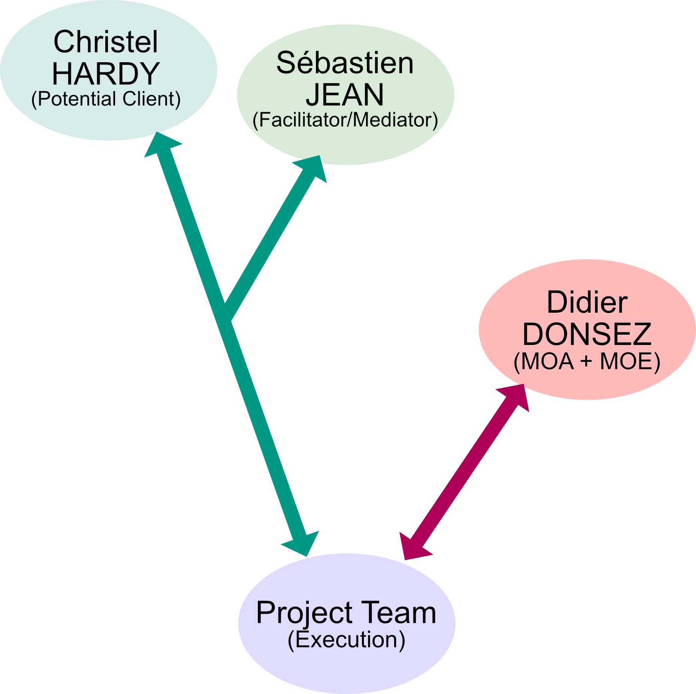
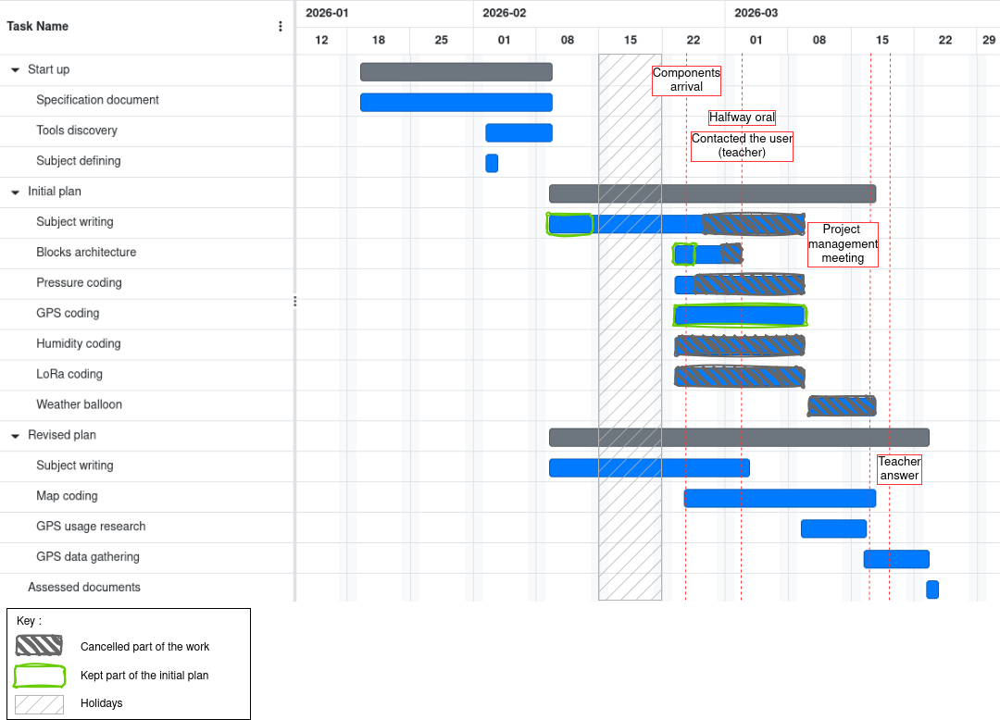
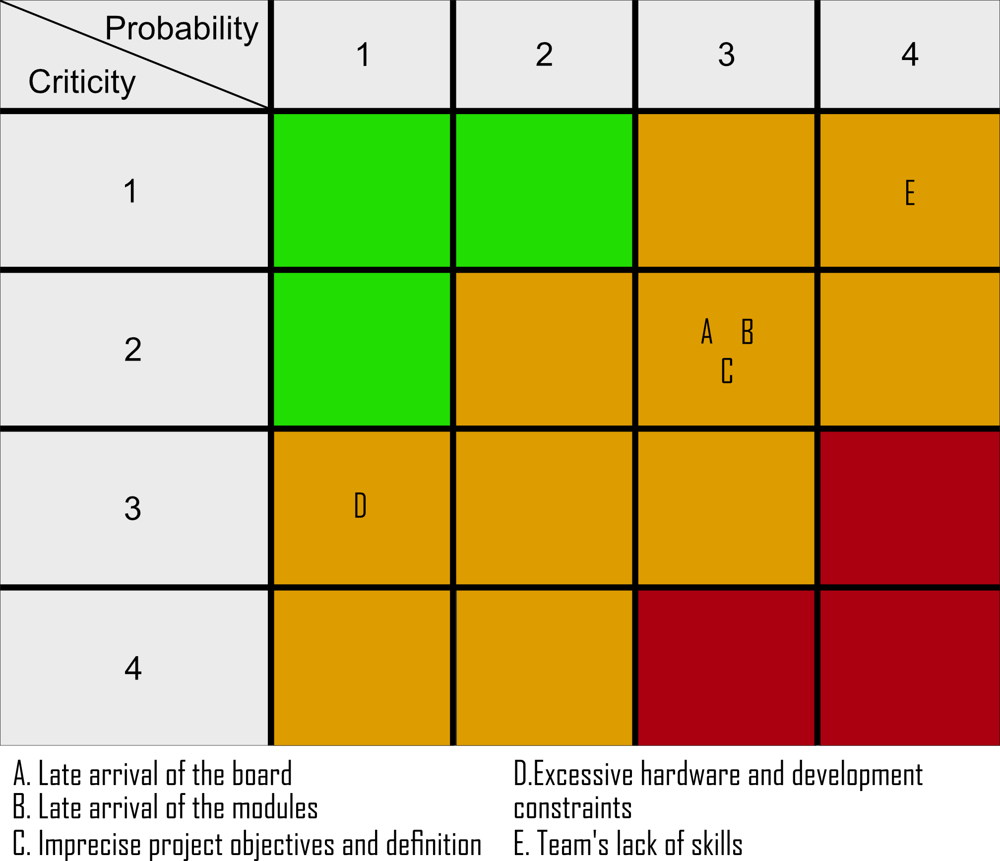
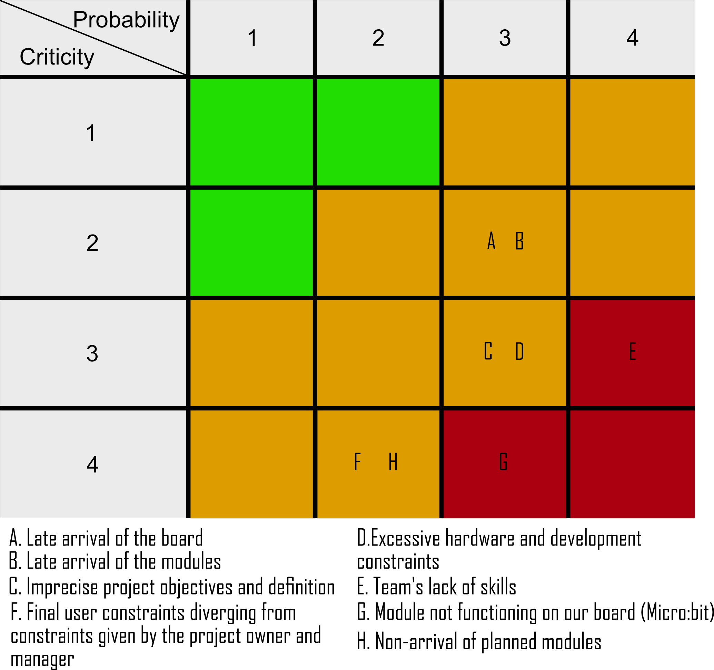

`\newpage{}`{=latex}

## 1. Abstract

`\newpage{}`{=latex}

## 2. Introduction

This project is a final 4th-year project for computer science engineering students at Polytech Grenoble. It takes place alongside other courses and an internship search that can prove to be stressful. The project is therefore set within an educational yet realistic context, with the aim of creating a situation representative of a corporate project.

Our subject involves creating an educational kit for teaching IoT (Internet of Things) in middle school. We are therefore targeting a level suitable for middle school students, with a pedagogical objective and a result intended for middle school teachers.

This project is supervised by Mr. Didier DONSEZ, who also represents the client, his needs, and requirements in the roles of Project Owner (PO, or MOA in french) and Project Manager (PM, or MOE in french). The project team consists of two students, Robin COURAULT and Sophie HAUGUEL, the project team has also a part of Project Manager role. After several weeks, we established contact with a potential client, an interested teacher, Mrs. Christel HARDY. At the same time, Mr. Sébastien JEAN identified himself as a facilitator/mediator for our communications with Mrs. HARDY.



The needs analysis proved complex due to our main contact's busy schedule. The specifications (cahier des charges) were difficult to define and stabilize; after a first version based on the single sentence serving as the project subject, we produced a second version by discussing it with Mr. DONSEZ, then adjusted it throughout the project as we progressed and asked questions. The validation of the second version of the specifications was never finalized despite our emails and verbal attempts. It was through questions and discussions that we refined the requirements.

The second version of our specifications identifies two expected deliverables, in addition to the deliverables inherent to the educational context (report + defense): a practical work (TP in french) assignment for teachers and middle schoolers, as well as an extension for the `MakeCode` no-code programming interface. These two deliverables were intended to allow the use of additional modules added to a `Micro:bit V2` board via a `SEED` expansion board, with the goal of enabling middle schoolers to create a weather balloon.

Thus, the practical work assignment was described in our specifications as being independent of other resources, intended for users already familiar with the `Micro:bit V2`, covering each new module useful for the weather balloon, and required to be in `Markdown` format. To suit middle school students, we agreed on a rather short format for each part of our practical work assignment, with each part consisting of:

- manipulation instructions, requiring exploration and understanding;
- a correction of the manipulations and short explanations;
- an optional discovery lesson to explain the relevance of the section toward building a weather balloon.

To cover all the modules necessary for the weather balloon while maintaining a logical and pedagogical sequence, we chose to define the following sections for the assignment:
- Introduction
- Launch test (checking if the board works)
- Exploration of the modules with:
    - Thermometer
    - Accelerometer
    - Pressure sensor
    - Humidity sensor
    - GPS
    - LoRa Transmitter/Receiver
- Development of the program for the weather balloon, also allowing for the consolidation of acquired knowledge.

To complement the TP assignment, an extension for `MakeCode` was requested, which should abstract the complex hardware operation of each module. This extension is exclusively intended for the `Micro:bit V2` board.

This description ultimately serves to fulfill the need to introduce middle schoolers to the Internet of Things (IoT).

`\newpage{}`{=latex}

## 3. Project Management

> Where to find the ressources:
>
> - in the `Appendices` section of this document
> - on github : <https://github.com/Robin-Courault/pxt-kit-pedagogique-iot-meteo/tree/main>
>   - check each branch

Project management focused on the following objectives:

- performing the bulk of the work during the sessions specifically reserved in the schedule
- ensuring all parts of the project are mastered by the entire team
- leveling up the team's skills to ensure everyone reaches a common level of proficiency.

### 3.1. Management Methods

For project management, we chose to follow an agile method based on an iterative cycle. Approximately every two weeks, changes in requirements and new discoveries led to new cycles. Throughout the project, parts of the deliverables were regularly deployable. Additionally, we integrated our potential client into the project process, though perhaps a bit too late. However, our project owner was integrated from the start and remained so throughout the project.

Each work session began with a short meeting regarding the work from the previous session, a brief recap of the remaining work, and then the distribution of tasks for the session. This distribution was handled through amicable discussion, but as a general rule, members who had a task to finish continued their work. In other cases, everyone chose what they wanted from the remaining tasks; it also frequently happened that one team member would ask another to continue or take over their work to provide a fresh perspective.

This organization allowed us to guarantee our objectives of global project mastery and skills leveling, as each part of the project could progress and develop skills on the task of their choice. The project team's excellent motivation allowed this method to work during the first few weeks of the project; however, as the project progressed, team motivation decreased, and it was only the will to finish that maintained the functionality of this organizational method. The small size of the team also contributed to the success of this approach.

All remaining work was managed using the `Jira` tool, allowing us to maintain tracking of the various tasks and sub-tasks to be completed; all tasks were carried out and updated in parallel with shifts in the specifications. We chose `Jira` because one team member was already familiar with the tool, and it provided a board for tasks and sub-tasks as well as an ordered schedule similar to a Gantt chart. In hindsight, the tool was far too heavy: one project member sometimes took nearly a minute to load each page, changes were applied with delays of about ten seconds, and the number of clicks required to modify a sub-task was far too high (around 4 or 5, with some buttons lost in an extremely dense interface). Furthermore, as the tool is very comprehensive, its complexity was a hindrance. `Jira` also included too many components for the scale of our project; we only used the `board`, `timeline`, and `list` out of the more than 14 available components. Choosing a simpler, lighter tool would have been more relevant.

Regarding other tools used, for the development environments, `VSCode` and `neovim` were employed. For `VSCode`, the interest lay in its excellent support and extensions for development (completion, syntax highlighting) for `TypeScript`—which we will discuss later—as both come from `Microsoft`. Additionally, `VSCode` was mastered by part of the team and could be used for other types of documents thanks to its extensions, facilitating the writing of `Markdown` files and the reading of PDFs, images, and JSON within the same tool. `neovim` was used because the other part of the team did not want to use a heavyweight IDE (Integrated Development Environment) on a low-performance computer and was more familiar with this tool. The online `Playground` interface from `Microsoft MakeCode` was also used extensively, notably to test code effects and functionality on the `MakeCode` interface and the `Micro:bit` board; testing via the direct `MakeCode` interface was quite heavy as it required a local installation (of several gigabytes). This `Playground` interface is also useful for development as it includes an editor with `TypeScript` auto-completion, as well as for libraries specific to `MakeCode` and the `Micro:bit`.

To continue with coding tools, we used `Git` and specifically `GitHub` repositories—primarily because `Git` is the only versioning tool we knew and mastered. Versioning is necessary in any project to ensure the ability to maintain a history of project versions and to be able to revert to a previous version in case of problems. `GitHub` was required for the creation of a `Microsoft MakeCode` extension, as the latter only accepts `GitHub` repositories for importing extensions. `MakeCode` itself was the destination imposed by our project manager and owner, Mr. DONSEZ, for the extension because it was the one the client used or desired. Using `MakeCode` also dictated the use of the `TypeScript` language to write the extension, as it is the only truly accepted language despite existing methods for using `C++`, which are very poorly documented.

Moving on to hardware, regarding the board and various sensors, our project owner imposed the choice of the `Micro:bit V2`. This did not seem particularly wise from a development perspective due to the lack of libraries for utilizing all the hardware modules provided to us. However, the board has the advantages of being inexpensive (~€20) and having several no-code interfaces; it is therefore suited for middle school use and thus for the needs identified for the project. For the sensors and transmitters, given the number of existing modules and the time allotted, we appreciated not having to choose them ourselves; the modules were quite well-documented, as we quickly found the necessary documentation once we knew what to look for.

Finally, regarding tools, communication was conducted orally in person, via `Discord`, or via `SMS`. The former was the simplest and most direct, while the other two covered remote moments. `SMS` was chosen because it is faster; as one team member did not have a smartphone, SMS was appropriate for low-latency exchanges, such as organizational communication (e.g., scheduling issues or absences). `Discord` was chosen for the rest of the remote communication; already used for student communications in the class, the entire team mastered it and had an account. Furthermore, it is much easier to read large texts on a computer than on a phone (`Discord` allows for both). `Emails` were also used, mainly to communicate with other stakeholders as we only had their contact info via this channel; this allowed us to inform all parties when necessary.
None of the tools used for communication truly guaranteed the confidentiality of exchanges; however, this was not an issue as the project had no confidentiality constraints.

### 3.2. Risks Analysis & Planning

Below is the Gantt chart for our project. This chart contains the original Gantt onto which we have overlaid the end-of-project Gantt. Elements crossed out in dark gray represent parts we cancelled; parts framed in green are the completed parts we kept for our final submission goal, following the many setbacks we faced—notably the absence of certain modules initially planned or the lack of time to perform certain tasks. The blue (not crossed out) section of the tasks represents the completed portion of those tasks.

It can be seen that we had to eliminate many parts initially planned; notably, a significant portion of the subject we had drafted was ultimately not kept. By "kept," we mean that it is a part that was finished but will not be useful as it concerns sensors we did not obtain, which therefore fall outside the project context. This specifically applies to the humidity and pressure sensors, for which implementation was also cancelled for this reason. The implementation of `LoRa` was cancelled primarily due to a lack of time, but also because members of another group, more specialized than us in embedded electronics, failed to make `LoRa` work on the `Micro:bit` despite having more time, expertise, and human resources. The part concerning the weather balloon was cancelled mainly due to lack of time but also as a consequence of other cancellations: a weather balloon only capable of measuring temperature and locating itself is not truly complete.



This perfectly illustrates the many hazards we faced and our difficulties in achieving a clear project. This Gantt chart also perfectly illustrates the fact that we did not identify many risks or that we did not properly assess their probability or the impact they could have on the project. We will look at this in more detail momentarily when discussing our risk analysis.

**Risks identified at the start:**

- **A.** Late arrival of the board => **Acceptance**: this is a significant risk, but one we cannot really do anything about in the context of this project. This would prevent us from testing both the board and the modules. However, we were familiar with the board before receiving it.
- **B.** Late arrival of the modules => **Reduction**: a high risk as it prevents creating drivers (as we had no idea of the model for some modules) and testing. We reduced the impact by anticipating the design so as not to delay the entire project if the risk became a certainty.
- **C.** Imprecise project objectives and definition => **Reduction** (of impact): by integrating regular validations and revisions of the specifications into the organization. If realized, this risk can cause major changes and waste time by forcing us to discard completed work.
- **D.** Excessive hardware and development constraints => **Acceptance**: risk of poor choices to fit constraints and overly complex development. Accepted because it was something we had no decision-making power over.
- **E.** Team's lack of skills => **Acceptance** (Provisioning): this is a risk accepted by choosing to reserve time for skill building.



**Re-evaluation of risks at the end of the project and new risks:**

- **F.** Final user constraints diverging from constraints given by the project owner and manager => **Avoidance** (or at least **Reduction**) by communicating more with and further integrating the final users (in this case, Christel HARDY) into the project.
- **G.** Module not functioning on our board (Micro:bit) => **Avoidance** by changing the module or the board. Or by removing this module from the specifications in the worst-case scenario. Or **Reduction** by selecting a board with better support and hardware libraries.
- **H.** Non-arrival of planned modules => **Acceptance** because there is little chance of this happening, but very problematic as it potentially wastes time by discarding work already performed.



As can be seen, several risks unforeseen at the start of the project proved critical when realized. The problem was that they occurred without us having anticipated mitigation strategies. Three of the five initial risks proved more impactful than expected, which also worked to our detriment.

### 3.3. Financial Assessment

This project was carried out with limited resources, though they were sufficient except regarding time. we had:
- 2 laptops
- 2 Micro:bit V2
- 1 XA1110 GPS module
- 2 LoRa transceivers, Wio-SX1262
- 2 students (Robin COURAULT & Sophie HAUGUEL) for approximately 50 hours each, totaling about one hundred man-hours.

`\newpage{}`{=latex}

## 4. Technical Work

### 4.1. Instructions Sheet

> See branch `sujet`, file `sujet/sujet.md`.

Initially, we built a first skeleton within the specifications. This first skeleton only contained the names of the parts and the breakdown of the subject.

We then developed a more advanced skeleton detailing each part. This time, we added a line to quickly describe the expected features of each section. In addition to this brief description, the skeleton for each part was more finely defined. Since the project aims to be educational, each part would consist of short explanations regarding its objective and context, manipulation instructions, a brief lesson, and a correction for the exercises. To make the tutorial more pleasant to use and easier for teachers to divide, the corrections section was subsequently moved to a separate section at the end of the document.

In the final stage, each part was written by completing the previously defined skeleton. An introduction was also added to present the final goal of the project: the development of a program for a sounding balloon or weather balloon. For each part, the first step was to introduce the section with a short sentence, such as: `To ensure everything is properly installed, let's start with a quick test:`. We then wrote the manipulation instructions to be as concise, explicit, and precise as possible, for example:

```md
- Try to make the LED blink.

    > It should turn on for 500ms, turn off for 500ms, then repeat indefinitely.
```

Following the instructions, a small lesson section explains the importance of the sensor in the context of a weather balloon. This lesson part required research, but there was no need to be exhaustive; its purpose was only to provide the broad outlines of the sensor's utility. We supplemented this with a short link redirecting to explanatory pages from Météo-France, so that interested students could find more information or an alternative explanation.

Finally, the drafting of the parts concluded with the correction elements, which were first built and tested on the MakeCode interface and then integrated as screenshots at the end of the subject in a separate section titled `Corrections`.

In total, 4 parts were written: `Thermometer`, `Pressure`, `Humidity`, and `GPS`, the latter not being completely finished as a short lesson is potentially missing. Furthermore, these parts do not all have a correction and are not necessarily implemented at the MakeCode extension level, but we will discuss this further on.

### 4.2. Code

> See branch `code`, file `main.ts`.

> The `//%` annotations in the code are used by MakeCode to generate blocks and categories in the interface.

#### 4.2.1. Blocks

> It should be noted that we are speaking here only of the methods and functions usable via the MakeCode interface in the form of blocks; we are not speaking of the additional code necessary to make them function.

##### 4.2.1.1. Pressure Sensor

For the first set of blocks, we focused on the pressure sensor, which we ultimately did not obtain, but here are the planned blocks:

- `setPressureRange` block: similar to the `setAccelerometerRange` present in MakeCode, the idea was to allow students to define a maximum value for the pressure sensor.
- `pressure` or `getPressure` block: this was simply intended to retrieve the current value from the pressure sensor, the current pressure.

> Having not obtained the pressure sensor, these blocks were not implemented.

##### 4.2.1.2. Humidity Sensor

For the second set of blocks, we addressed the humidity sensor:

- `humidity` or `getHumidity` block: used simply to retrieve the current value of the sensor.
- `onHumidityChange` block: which we considered optional, intended to be an event—meaning a block that executes the code provided as soon as the humidity changes.

> Having not obtained the humidity sensor, these blocks were not implemented.

##### 4.2.1.3. GPS

For the third set of blocks, the GPS was addressed:

- `getLocation` block: allows the current location to be retrieved in the form of an object consisting of two elements; this block aimed to introduce students to the world of the object-oriented paradigm while providing a simple way to retrieve a meaningful location.
- `getLocationElement` block: allowing the retrieval of the longitude or latitude of a `Location` object using a block that lets the user select one or the other value via a dropdown list.
- We then chose to add several additional blocks to add interaction to the project and allow students to visually see the location evolve; we will see the implementation in more detail in the [Map library](#422-map-library) section. Of course, these blocks are not intended for use in the actual weather balloon:
    - `createMap` block: allowing the construction of a `Map` object; this object can be seen as an aggregate of `Location` objects converted into flat coordinates. The `Map` object aims to allow the display of `Locations` more simply for students using the Micro:bit's 5x5 LED screen.
    - `addLocation` block: allowing a `Location` to be added to a `Map`.
    - `clearMap` block: allowing all points in a `Map` to be deleted.
    - `setAnchor` block: allowing the anchor point used to display the `Map` to be redefined from a `Location` (without adding the `Location` to the Map points).
    - `moveAnchor` block: allowing the anchor point to be redefined by providing an offset in grid cells from the current anchor point.
    - `setCellSize` block: allowing the size of the `Map` cells to be redefined; when at least 1 point is located in a cell, it is lit up.

##### 4.2.1.4. LoRa

For the final set of blocks, LoRa was addressed:

- `sendMsg` block: allowing a LoRa message to be sent on a specific constant frequency.
- `sendMsgFreq` block: allowing a LoRa message to be sent on a given frequency.
- `receiveMsg` block: allowing a LoRa message to be received on a specific constant frequency (the same as the `sendMsg` block).
- `receiveMsgFreq` block: allowing a LoRa message to be received on a given frequency.
- `onReceiveMsg` block: an event block executing its code when a message is received.

This set of blocks would have allowed us, in our opinion, to do pretty much whatever we wanted with LoRa. However, according to the group of students working on the same board as us, the LoRa transmitter was unusable on a Micro:bit. In any case, we would not have had the time to complete this part.

#### 4.2.2. Map library

The `Map` library we built contains all the blocks accessible on the MakeCode interface as well as all the functions and objects necessary for their operation.

Initially, we have two enumerated types: `anchorPositionType`, which corresponds to the position of the anchor point on the display (center, top-left corner, top-right corner, bottom-left corner, and bottom-right corner), and `sizeUnitType`, which corresponds to a distance unit (meter or kilometer).

```ts
export enum anchorPositionType {
    //% block="Center"
    anchorCenter,
    //% block="Top left corner"
    anchorTopLeft,
    //% block="Top right corner"
    anchorTopRight,
    //% block="Bottom left corner"
    anchorBottomLeft,
    //% block="Bottom right corner"
    anchorBottomRight
}

export enum sizeUnitType {
    //% block="m"
    m,
    //% block="km"
    km
}
```

We therefore have a `Map` object (below), carrying information about its anchor point, the size of its cells, its points, the display size, and the pixels to turn on during display. This last field avoids allocating a new array in memory for every display update.
The constructor takes a cell size and a unit as parameters; the `Map` retrieves the current position to use as the initial anchor point and defines it as the center of the display.

```ts
export class Map {
        anchor_m : Point2D; // in meters
        anchorPosition : anchorPositionType;
        cellSize_m : number; // in meters
        points : Point2D[];
        printSize : number = 5;
        pixelsToTurnOn : boolean[][];

        constructor(
            cellSize : number,
            sizeUnit : sizeUnitType
            ) {
                this.anchor_m = (inputSeed.getLocation()).toPoint2D();
                this.anchorPosition = anchorPositionType.anchorCenter;
                if (sizeUnit == sizeUnitType.m) {
                    // sets the size in meters
                    this.cellSize_m = cellSize;
                } else {
                    // converts the size to meters
                    this.cellSize_m = cellSize*1000;
                }
                this.points = [];
        }
        ...
```

However, to simply allow the creation of `Map` objects, a helper function `newMap` will be used as a block in MakeCode. The first annotation defines the block text, the second the name of the variable to be populated with the constructed object, and the last defines the default value for the `cellSize` parameter. The other two annotations are only for the visual behavior of the block.

```ts
//% block="new Map centered on current location || and cells measuring $cellSize $sizeUnit"
//% blockSetVariable=map
//% inlineInputMode=external
//% expandableArgumentMode="toggle"
//% cellSize.defl=1
export function newMap(cellSize : number, sizeUnit : sizeUnitType) {
    return new Map(cellSize, sizeUnit);
}
```

In a `Map`, we do not store a `Location` directly but rather `Point2D` objects; these also have 2 numerical values, but they do not have the same meaning and correspond to flat coordinates in meters.

```ts
export class Point2D {
    x : number;
    y : number;

    constructor(x : number, y : number) {
        this.x = x;
        this.y = y;
    }
}
```

These objects are constructed from a `Location` using the latter's `toPoint2D()` method, which handles the conversion. This responsibility could have belonged to the `Point2D` objects, but it also seemed entirely consistent to us that another object should implement its own conversion since it is best placed to know its own structure.

```ts
//Formula found on : https://gis.stackexchange.com/a/488625
// Returns the equivalent flat coordinates (in 2D meters)
// The y axis grows from south to north
// The x axis grows from west to east
toPoint2D(): map.Point2D {
    const lat_rad: number = degToRad(this.latDeg);

    const x_m: number = this.lonDeg * 111111 * Math.cos(lat_rad);
    const y_m: number = this.latDeg * 111111;

    return new map.Point2D(x_m, y_m);
}
```

Regarding the simple blocks for using the `Map` object, the code is self-explanatory, so here it is below:

```ts
//% block="Set $anchor as anchor on $position for $this"
//% this.defl=map
setAnchor(anchor : inputSeed.Location, position : anchorPositionType) {
    this.anchor_m = anchor.toPoint2D();
    this.anchorPosition = position;
}

//% block="Move $anchor of $this of $nCellsAbscisse cells in x and $nCellsOrdonnee cells in y"
//% this.defl=map
moveAnchor(nCellsAbscisse : number, nCellsOrdonnee : number) {
    this.anchor_m.x += nCellsAbscisse*this.cellSize_m;
    this.anchor_m.y += nCellsOrdonnee*this.cellSize_m;
}

//% block="Set cell size of $this to $cellSize $sizeUnit"
//% this.defl=map
setCellSize(cellSize : number, sizeUnit : sizeUnitType) {
    this.cellSize_m = (sizeUnit == sizeUnitType.m) ? cellSize : cellSize*1000;
}

//% block="Add $location to $this"
//% this.defl=map
addLocation(location : inputSeed.Location) {
    this.points.push(location.toPoint2D());
}

//% block="Remove all locations in $this"
//% this.defl=map
clear() {
    this.points = [];
}
```

As for the display block (`print`), we will not cover all of its code as it is quite long, but you can find its code and that of its utility functions in the [Appendices](#611-map---print--additionnals-functions). The general idea is as follows:
- Reset the array of pixels to be lit.
- Define a top boundary value and a left boundary value based on the display position and the anchor point coordinates.
- Set the anchor point pixel as one to be displayed, even if it is not part of the `Map` points.
- Iterate through the `Map` points within the defined boundaries and note the pixels to be displayed.
- Convert the array of pixels to be displayed into a character string according to the format expected by the MakeCode standard library function for lighting an LED array.
- Display the portion of the `Map` by lighting the LEDs.

#### 4.2.3. GPS library

The GPS module library includes functions for retrieving sentences from the module, parsing them, and extracting longitude and latitude values, as well as module configuration and basic blocks for MakeCode.

Let's start with the blocks involving the `Location` object; since the object's structure is self-descriptive, let's continue with obtaining a new object of this type.

```ts
export class Location {
    latDeg: number; // in degrees
    lonDeg: number; // in degrees

    constructor(latitude : number, longitude : number) {
        this.latDeg = latitude;
        this.lonDeg = longitude;
    }
    ...
```

Obtaining a new `Location` involves retrieving the last current location. The choice was made to have a regular background loop responsible for retrieving sentences from the module and extracting the latest location to avoid saturating the I2C buffer connecting the module to our board, thus preventing a GPS module reset.

```ts
//% block="retrieve current location"
//% blockSetVariable=location
//% group="GPS"
export function getLocation(): Location {
    return lastLocation;
}
```

We will discuss the regular loop later; first, let's talk about the last block accessible from the outside: the `getLocationElement` method, which simply returns one or the other field of a given `Location` object in the block, depending on the `typeVal` parameter which corresponds to the `locationType` enumeration.

```ts
export enum locationType {
    //% block="Longitude"
    locationLon,
    //% block="Latitude"
    locationLat
}
```

```ts
//% block="get $typeVal of $this"
//% group="GPS"
//% this.defl=location
getLocationElement(typeVal: locationType): number {
    if (typeVal === locationType.locationLat) {
        return this.latDeg;
    } else if (typeVal === locationType.locationLon) {
        return this.lonDeg;
    } else {
        return NaN;
    }
}
```

Returning to the regular loop (called every 200ms in the background) mentioned earlier: it retrieves all sentences—that is, it retrieves all raw data available from the GPS module and extracts complete sentences. The loop then iterates through each sentence, splitting it to isolate each field, removing the checksum, and then processing it. Processing consists of attempting to read a `GGA` sentence; if no location is found, it attempts to read an `MTK` sentence; otherwise, it defines the last location as the one just retrieved.

```ts
loops.everyInterval(200, function () {
    let trames = inputSeed.getAllTrames();

    for (let i = 0; i < trames.length - 1; i++) {
        if (trames[i].trim().length > 0) {
            let parts = trames[i].trim().split('*')[0].split(',');
            let tempLoc = inputSeed.parseTrameGGA(parts);

            if (tempLoc != null) {
                inputSeed.setLastLoc(tempLoc);
            } else {
                inputSeed.checkTrameMTK(parts);
            }
        }
    }
});
```

This loop retrieves all sentences via `getAllTrames()`. This function retrieves all available raw data and adds it to the buffer containing the last incomplete sentence. Then, the function splits the set of sentences into an array and keeps the last sentence because it is incomplete; note that if the last sentence is complete, the last element of the sentence array will contain an empty string.

```ts
export function getAllTrames(): string[] {
    let raw = readRawData();
    if (raw.length === 0) return [];

    trameBuffer += raw;

    // Processing complete phrases
    let lines = trameBuffer.split("\n");

    // Keep the last incomplete line in the buffer
    trameBuffer = lines[lines.length - 1];

    return lines;
}
```

The retrieval of raw data is done by reading a maximum of 32 bytes from the GPS module's address. For each byte, it checks if it is a printable character or one of the two end-of-line characters; if so, it adds it to the result returned at the end.

> Note that subsequently, we will have two '\n' at each line end, which will create empty array elements in `getAllTrames()` during splitting; however, this is not a problem as an empty element is ignored in the regular loop.

```ts
function readRawData(): string {
    let result = "";
    try {
        // Reading bytes from the module
        let data = pins.i2cReadBuffer(GPS_ADDRESS, 32, false);

        for (let i = 0; i < data.length; i++) {
            let charCode = data.getNumber(NumberFormat.UInt8LE, i);
            // Filter valid characters (printable ASCII)
            if (charCode >= 32 && charCode <= 126) {
                result += String.fromCharCode(charCode);
            } 
            // CR + LF
            else if (charCode === 13 || charCode === 10) {
                result += "\n";
            }
        }
    } catch (e) {
        result = "";
    }
    return result;
}
```

Regarding the analysis of GGA sentences, the code is quite simple: we check the value of the first field to ensure it is a GGA sentence, verify that we have a GPS fix, and then retrieve the longitude and latitude by converting them into a single decimal value each, avoiding the format that includes time and cardinal direction. We then return a `Location` object created with the retrieved longitude and latitude values.

```ts
const GGA_LAT_POS = 2;
const GGA_LON_POS = 4;
const GGA_FIX_GPS_POS = 6;
export function parseTrameGGA(trame : string[]): Location | null {
    // GP = GPS | GN = GPS + GLONASS
    if (trame[0] == "$GPGGA" || trame[0] == "$GNGGA") {
        // if FIXGPS (= positioning type) = 0 then no position fix,
        // we would preferably like GPS (=1) but fundamentally as long as it's fixed, it suits us.
        if (parseFloat(trame[GGA_FIX_GPS_POS]) > 0) {
            let lat = nmeaToDegrees(trame[GGA_LAT_POS], trame[GGA_LAT_POS+1]);
            let lon = nmeaToDegrees(trame[GGA_LON_POS], trame[GGA_LON_POS+1]);

            return new Location(lat, lon);
        } else {
            return null;
        }
    } else {
        return null;
    }
}
```

For the processing of MTK sentences, we check the prefix and then remove it. In the case where we have a system message, we look at its meaning; if it indicates the end of startup, we define the sentences we wish to receive—in this case, only GGA.

```ts
const MTK_INIT_CMD = "$PMTK314,0,0,0,1,0,0,0,0,0,0,0,0,0,0,0,0,0,0,0*29\r\n";
let isStarted : boolean = false;
export function checkTrameMTK(trame : string[]): boolean {
    if (trame[0].substr(0,5) == "$PMTK") {
        switch (trame[0].substr(5)) {
            case "010": // sys_msg
                // msg = startup ended
                if (trame[1] == "002" && !isStarted) {
                    // setup the sending of GGA sentences
                    let buf = pins.createBuffer(MTK_INIT_CMD.length);
                    for (let i = 0; i < MTK_INIT_CMD.length; i++) {
                        buf.setNumber(NumberFormat.UInt8LE, i, MTK_INIT_CMD.charCodeAt(i));
                    }
                    pins.i2cWriteBuffer(GPS_ADDRESS, buf, false);
                    isStarted = true;
                }
                break;
            case "001": // ack
                // we do not handle the acknowledgment of our initialization
                if (trame[1] == "314" && trame[2] == "3") {}
            default:
                break;
        }
        return true;
    } else {
        return false;
    }
}
```

There we go; thanks to all of this, the GPS module has what it needs to function. However, we encountered a problem: the module keeps resetting (restarting its startup procedure) without us knowing why, despite numerous attempts and research.

`\newpage{}`{=latex}

## 5. Conclusion

> Assessment:
> > Pay more attention to risks, anticipate more (warning to the time management).
> > Sometimes, it's easier to recreate a library than to use a library that is not suitable for our use case.
> > Contact the client earlier.
> > Not being free to choose can struggle the project team and make the project very difficult.

> Doorway:
> > Completion of the SEED with pressure sensor, humidity sensor (or weather station).
> > Make a library to use LoRa emitter.
> > End the micro-library for GPS XA1110.
> > Complete the Instructions Sheet with a tutorial to create a weather balloon, the part to learn how to use GPS, the part on the LoRa emitter and answers for each new part.

#### 3.4.2. 

#### 3.4.3. Deliverables

> Expected:
> > One Instructions Sheet (with details on each part)
> > One Micro:bit Extension for Microsoft MakeCode (with each block & functions expected)
> > A report

> Finish:
> > One Instructions Sheet (with details on what part is done and not ended parts)
> > One Micro:bit Extension for Microsoft MakeCode (with each block implemented)
> > This report, witness of our difficulties

#### 3.4.1. Impacts

> In prevision, can learn to college students how a weather balloon works and understand the quantity of different use the IoT have => Education Impact + Can be funny

Finalement pour conclure cette partie 

`\newpage{}`{=latex}

## 6. Appendices

> All charts
> Summary of project management meeting
> Screenshots of MakeCode
> Parts of Code, if required (for example if we use code out of context in the report, we can put the complete code here)

### 6.1. Code

#### 6.1.1. Map - print & additionnals functions

```ts
print() {
    this.resetpixelsToTurnOn();
    let screenTop : number;
    let screenLeft : number;

    switch (this.anchorPosition) {
        case anchorPositionType.anchorTopLeft :
            screenTop = this.anchor_m.y + (this.cellSize_m/2);
            screenLeft = this.anchor_m.x - (this.cellSize_m/2);
            this.pixelsToTurnOn[0][0] = true;
            this.setPointsToTurnOn(screenTop,screenLeft);
            break;
        case anchorPositionType.anchorTopRight :
            screenTop = this.anchor_m.y + (this.cellSize_m/2);
            screenLeft = this.anchor_m.x - (this.cellSize_m*this.printSize + this.cellSize_m/2);
            this.pixelsToTurnOn[0][this.printSize-1] = true; // last char
            this.setPointsToTurnOn(screenTop,screenLeft);
            break;
        case anchorPositionType.anchorCenter :
            screenTop = this.anchor_m.y + (this.cellSize_m*this.printSize/2 + this.cellSize_m/2);
            screenLeft = this.anchor_m.x - (this.cellSize_m*this.printSize/2 + this.cellSize_m/2);
            this.pixelsToTurnOn[this.printSize/2][this.printSize/2] = true; // mid char
            this.setPointsToTurnOn(screenTop,screenLeft);
            break;
        case anchorPositionType.anchorBottomLeft :
            screenTop = this.anchor_m.y + (this.cellSize_m*this.printSize + this.cellSize_m/2);
            screenLeft = this.anchor_m.x - (this.cellSize_m/2);
            this.pixelsToTurnOn[this.printSize-1][0] = true;
            this.setPointsToTurnOn(screenTop,screenLeft);
            break;
        case anchorPositionType.anchorBottomRight :
            screenTop = this.anchor_m.y + (this.cellSize_m*this.printSize + this.cellSize_m/2);
            screenLeft = this.anchor_m.x - (this.cellSize_m*this.printSize + this.cellSize_m/2);
            this.pixelsToTurnOn[this.printSize-1][this.printSize-1] = true; // last char
            this.setPointsToTurnOn(screenTop,screenLeft);
            break;
    }
    
    basic.showLeds(this.convertPixelsToTurnOnInString());
}

setPointsToTurnOn(limitTop : number, limitLeft : number) {
    this.points.forEach(p => {
        if (p.x >= limitLeft && p.x < limitLeft + this.printSize*this.cellSize_m 
            && p.y <= limitTop && p.y > limitTop - this.printSize*this.cellSize_m) {
            // parcours de toutes les lignes de la grille
            for (let i = 1; i <= this.printSize; i++) {
                let j : number;
                // parcours de toutes les colonnes de la grille
                for (j = 1; j <= this.printSize; j++) {
                    // case where cell is already true
                    if (this.pixelsToTurnOn[i-1][j-1]) {
                        break;
                    }
                    // case where p is in [i-1][j-1] cell
                    else if (p.x < limitLeft + j*this.cellSize_m && p.y > limitTop - i*this.cellSize_m) {
                        this.pixelsToTurnOn[i-1][j-1] = true;
                        break;
                    }
                }

                // case where break in prev (j) loop, p can't be in two cells
                if (this.pixelsToTurnOn[i-1][j-1]) {
                    break;
                }
            }
        }
    });
}

convertPixelsToTurnOnInString() : string {
    let stringGrid = "";
    this.pixelsToTurnOn.forEach(l => {
        l.forEach(c => {
            stringGrid = c ? stringGrid += '#' : stringGrid += '.';
        })
        stringGrid = stringGrid.concat("\n");
    });
    return stringGrid;
}

resetpixelsToTurnOn() {
    // réutilisation pour éviter de trop réserver de la mémoire
    if (this.pixelsToTurnOn && this.pixelsToTurnOn.length === this.printSize) {
        for (let i = 0; i < this.printSize; i++) {
            for (let j = 0; j < this.printSize; j++) {
                this.pixelsToTurnOn[i][j] = false;
            }
        }
    } else {
        // Initialisation première fois
        this.pixelsToTurnOn = [];
        for (let i = 0; i < this.printSize; i++) {
            this.pixelsToTurnOn.push([]);
            for (let j = 0; j < this.printSize; j++) {
                this.pixelsToTurnOn[i].push(false);
            }
        }
    }
}
```

`\newpage{}`{=latex}

## 7. Bibliography

> SEED's github
> Micro:bit documentation on micro:bit v2 board
> Microsoft documentation on micro:bit v2 board
> MakeCode documentation
> XA1110 Sparkfun explainations and library
> XA1110 Hardware Plan
> PMTK documentation
> LoRa Emitter Hardware Plan
> Forums, which ones ?
