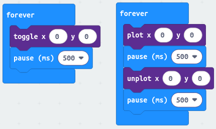
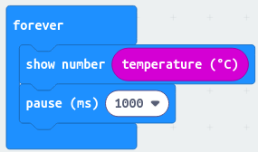

# Kit pédagogique SEED micro:bit

## I. Intro

    Connais-tu les ballons-sondes ?  

Ces ballons permettent de faire des mesures dans l'atmosphère. Nous nous intéressons aux ballons météorologiques, dont la nacelle est remplie de capteurs.

Ils s'élèvent dans le ciel, à plus de 25km du sol ! Cela leur permet de mesurer la température, l'humidité, la vitesse du vent et beaucoup d'autres données. Grâce à toutes les données récoltées depuis les ballons météorologiques, nous pouvons prédire la météo !

L'objectif de ce travail pratique est de réaliser un programme capable de mesurer des données et de les envoyer à une antenne, ce programme sera mis en application par une carte électronique qui pourra ensuite être déposée dans la nacelle d'un ballon :

1. Après un court test de la carte, tu vas découvrir chaque capteur indépendamment afin de comprendre leur fonctionnement et leur utilisation. [Partie III - Les Capteurs](#iii-les-capteurs).
2. Une fois les capteurs maitrisés, tu découvriras un moyen de communication qu'utilises les objets connectés, la communication à longue portée dites `LoRa` pour `Long Range`. [Partie IV - La communication LoRa](#iv-communication-lora-à-ajouter)
3. Une fois que tu sauras utiliser tous les capteurs et communiquer, tu pourras réaliser ton propre programme de ballon météo. [Partie V - Le Ballon](#v-ballon-météorologique--envoi-de-toutes-les-données-au-format-aprs-).

> Pas de panique, tu seras guidé tout au long de ce travail pratique.

**Attention :** toucher les parties métalliques de la carte pendant son fonctionnement peut l'abîmer ! De plus, la carte n'aime pas l'eau...

## II. Test de lancement - Faire clignoter une LED

Pour s'assurer que tout est bien installé, commençons par un petit test :

- Essaie de faire clignoter la LED.

    > Elle doit s'allumer 500ms, s'éteindre 500ms puis recommencer indéfiniment.

**Si tu n'as pas réussi** aucun problème, jette un oeil à [la fin du sujet ou clique ici pour voir la solution.](#via-correction---test-de-lancement)

## III. Les capteurs

### III.A. Thermomètre (micro:bit)

#### III.A.1. Utilisation du thermomètre

Essayons maintenant de faire fonctionner le thermomètre :

1) Affiche la température capturée par le thermomètre de la carte.

    1. Récupérer la température.
    2. Afficher la valeur récupérée.

2) Est-ce que la température affichée se met à jour ?
    - Si oui, bien joué, tu avais déjà tout prévu.
    - Sinon, fais en sorte que l'affichage change lorsque la carte se réchauffe ou se refroidit.

    Dans tous les cas, tu peux tester si ça marche en soufflant dessus, en la mettant dehors, en la rapprochant d'un radiateur, etc.

**Si tu n'as pas réussi** aucun problème, jette un oeil à [la fin du sujet ou clique ici pour voir la solution.](#vib-correction---thermomètre)

#### III.A.2. Mais quel intérêt de connaître la température ?

Connaitre la température a plusieurs intérêts :

- Le premier vise à analyser les évolutions de température ou de moyenne de température dans une zone et ce sur plusieurs années, les températures collectées sont donc archivées sur de longues durées.
    > Cela permet notamment de constater une réelle augmentation des températures moyennes en France par exemple mais plus généralement dans le monde sur les quelques dernières dizaines d'années. Salut le réchauffement climatique !
- Le second intérêt est de mettre en évidence des zones à fortes différences de température, identifiant les différents fronts des perturbations.
- Le troisième intérêt plus utile pour nous est d'identifier les zones favorables aux orages caractérisées par de l'air chaud en bas et de l'air froid en altitude.

[Pour en savoir plus, Météo France a une petite page explicative, clique ici](https://meteofrance.com/comprendre-la-meteo/temperatures/quest-ce-que-la-temperature).

<!-- ### Accéléromètre (micro:bit) -->
<!---->
<!-- 1) fonction d'affichage de barre d'accélération -->
<!-- 2) affichage de l'accélération -->

### III.B. Pression (SEED)

#### III.B.1. Utilisation du capteur de pression

##### III.B.1.a. La valeur de pression

Commençons par afficher la pression capturée par le capteur de la carte :

1. Récupérer la pression.
2. Afficher la valeur récupérée.
3. Faire en sorte que la valeur se mette à jour régulièrement.

> As-tu remarqué que la valeur ne change pas beaucoup ?
> Des explications sont présentes un [peu plus loin](#iiib2-mais-la-pression-quest-ce-que-cest-) pour t'expliquer pourquoi.

**Si tu n'as pas réussi** aucun problème, jette un oeil à [la fin du sujet ou clique ici pour voir la solution.](#vic1-correction---pression---affichage-de-la-valeur)

##### III.B.1.b. La précision de pression (pressure range en anglais)

> La précision correspond à l'intervalle/la plage des valeurs récupérables avec les blocs que tu as utilisé dans la manipulation précédente.

    TODO : exercice de manipulation de la pressure range.

**Si tu n'as pas réussi** aucun problème, jette un oeil à [la fin du sujet ou clique ici pour voir la solution.](#vic2-correction---pression---la-précision)

#### III.B.2. Mais la pression qu'est ce que c'est ?

Ici, on parle de pression atmosphérique, c'est à dire la force exercé par le poids de l'air sur une surface, cette force est exprimée en Pascal (Pa).

La pression atmosphérique évolue lorsque l'on monte en altitude, au niveau de la mer (0m d'altitude), on a en moyenne 1013.25 hectoPascals. Imaginez un peu, une colonne d'air d'1m2 soit un carré d'un mètre par un mètre partant de la surface de la Terre et montant jusqu'au sommet de l'atmosphère (en moyenne 600km d'altitude) a une masse de près de 10 000kg.

Les ballons-sondes volent aux alentours de 25km d'altitude, à cette hauteur, la pression est d'environ 25 hPa (hectoPascals).

[Pour en savoir plus, Météo France a une petite page explicative, clique ici](https://meteofrance.com/actualites-et-dossiers/comprendre-la-meteo/quest-ce-que-la-pression-atmospherique).

#### III.B.3. La pression à quoi ça sert ?

Pour faire simple, une pression importante est synonyme de temps calme et de beau temps, à l'inverse une pression faible va de paire avec le brouillard et les nuages bas.

Mais les valeurs ne sont pas la seule donnée leurs variations ont également une importance, par exemple une diminution rapide est souvent synonyme de pluie et de vents violents.

Enfin ça c'est pour faire simple car le temps est quelque chose de complexe, l'important c'est d'avoir des données de façon constante afin de pouvoir faire des analyses et continuellement apprendre et se corriger.

### III.C. Humidité (SEED)

#### III.C.1. Utilisation du capteur d'humidité

##### III.C.1.a. Afficher la valeur

Commençons une fois de plus par afficher la valeur du capteur d'humidité, n'hésites pas à réutiliser ce que tu as réalisé précédemment.

1. Récupérer la valeur d'humidité.
2. Afficher la valeur récupérée.
3. Faire en sorte que la valeur se mette à jour régulièrement.

> Tu peux essayer de souffler sur le capteur ou la carte pour augmenter l'humidité, tu peux aussi couvrir la carte avec ta main.

**Si tu n'as pas réussi** aucun problème, jette un oeil à [la fin du sujet ou clique ici pour voir la solution.](#vid1-correction---humidité---affichage-de-la-valeur)

##### III.C.1.b. Fonction d'affichage de barre

Cette fois, allons un peu plus loin, essaies d'afficher l'humidité sous la forme d'une barre ou d'un nombre de LEDs qui suit les évolutions de la valeur de l'humidité.

1. Déterminer l'incrément, l'intervalle de valeur pour chaque LED allumée ou chaque colonne de ta barre d'affichage. Par exemple essaie du 1 pour 1, chaque valeur entière correspond à un nombre de LEDs allumées, ainsi, `8`, `8.3`, `8.5` ou encore `8.31546` de valeur d'humidité correspondent tous à 8 LEDs allumées. Est-ce-que cela te semble pertinent ? Si ce n'est pas le cas, prend un autre incrément.
2. Créer une boucle qui récupère la valeur et allume un certain nombre de LEDs en fonction de la valeur récupérée.

> Dans le cas d'une barre, tu possèdes donc 5 LEDs de longueur, donc 6 valeurs possibles (en comptant 0).
> Dans le cas d'un nombre de LEDs, tu possèdes 25 LEDs sur la Micro:bit, donc 26 valeurs possibles (en comptant 0).

**Si tu n'as pas réussi** aucun problème, jette un oeil à [la fin du sujet ou clique ici pour voir la solution.](#vid2-correction---humidité---fonction-daffichage-en-barre)

#### III.C.2. L'humidité, ça sert à quoi ?

Pour commencer l'humidité est mesurée sous deux formes en météorologie :

- La valeur absolue, indépendante de la température qui mesure la quantité de vapeur d'eau dans un volume d'air donné, généralement exprimée en g/m3 (grammes d'eau par mètre cube d'air).
- La valeur relative, dépendante de la température et qui correspond au rapport entre la quantité d'eau contenue dans l'air et la quantité maximale possible, exprimée en pourcentages (la quantité de vapeur d'eau dans l'air occille entre 0.1 et 5% du volume d'air total, la valeur relative est donc à 100% lorsque la quantité d'eau atteint 5% du volume d'air total).

En météorologie, l'humidité est l'un des éléments utilisés pour donner des températures ressenties mais elle donne beaucoup d'autres informations comme la présence de nuages, les chances de précipitations (pluies), de brume et de brouillard. C'est un paramètre important qui fait partie d'un tout avec la pression et la température afin de prévoir la météo.

[Pour en savoir plus, Météo France a une petite page explicative, clique ici](https://meteofrance.com/actualites-et-dossiers/comprendre-la-meteo/quest-ce-que-lhumidite).

### III.D. GPS

Pour utiliser le GPS, nous allons avoir besoin d'objets, dans le cadre d'un code un objet est un élément qui contient des données et peut effectuer des actions. Dans le cas de notre GPS, on possède deux objets que l'on peut utiliser :

- Les objets de type `Location` (ou localisation en français) qui contiennent des coordonnées d'un point dans le monde, ils peuvent fournir la latitude et la longitude ainsi que se transformer en un point (utilisé dans l'objet suivant).
- Les objets de type `Map` (ou carte en français) qui représentent un ensemble de points répartis sur des cases, ces objets servent à stocker et afficher plus facilement un ensemble de points (construits à partir d'objets `Location`).

#### III.D.1. Afficher les coordonnées

Avant d'utiliser les objets `Map` qui sont plus compliqués, essayons d'afficher les coordonnées de la carte grâce aux objets `Location` :

1. Récupérer un objet `Location` qui contient les coordonnées (latitude & longitude).
2. Afficher la latitude, puis la longitude de l'objet `Location` récupéré.
3. Faire en sorte que la valeur s'actualise.
4. Se déplacer avec la carte (sur plusieurs mètres) et vérifier que les coordonnées affichées changent.

**Si tu n'as pas réussi** aucun problème, jette un oeil à [la fin du sujet ou clique ici pour voir la solution.](#vie1-correction---gps---afficher-les-coordonnées)

#### III.D.2. Utiliser une carte

Maintenant que tu sais utiliser une localisation GPS, nous allons explorer l'objet `Map` :

1. Construire un objet `Map` en utilisant une localisation récupérée au préalable. Nous te conseillons d'utiliser une taille de quelques mètres (entre 1 et 5) pour les cellules afin de pouvoir tester facilement par la suite.
2. Ajouter d'autres localisations à la carte (**Attention :** les localisations doivent être espacées de quelques mètres pour la suite).
3. Afficher la carte & remarquer que les cases dans lesquelles au moins une localisation se situe sont représentées par des LEDs allumées.
4. Déplacer la zone d'affichage de la carte (L'ancre de la carte est le point à partir duquel la carte est affichée, la carte affiche uniquement une zone de 5*5 cellules même si elle a plus de cellules remplies).
5. Afficher de nouveau la carte & constater que les points se sont déplacer ou que de nouveaux sont apparus.

**Si tu n'as pas réussi** aucun problème, jette un oeil à [la fin du sujet ou clique ici pour voir la solution.](#vie1-correction---gps---utiliser-une-carte)

## IV. Communication LoRa

- Cours : utilisation limitée
- Emission et réception de messages
- Ajout d'un header pour trier la réception
- Envoi de différentes données (nécessitant test côté récepteur)

## V. Ballon météorologique

- Cours : Le format APRS et pourquoi l'utiliser ?
- Accompagnement des élèves à travers la fusion de tout ce qui a été vu précédemment dans l'objectif de former un ballon météorologique utilisable.

## VI. Corrections

Bienvenue dans la section des corrections, tu trouveras ci-dessous des corrections aux exercices pratiques du sujet. Il y a **souvent plusieurs bonnes réponses** et les **corrections ne contiennent pas toutes les bonnes façons de répondre** à un exercice, en cas de doute, demande au professeur de vérifier ta réponse.

> **Note :** En règle générale nous réalisons la réponse la plus concise (= courte) possible.

### VI.A. Correction - Test de lancement

Pour cette correction, nous avons choisi d'allumer la LED en haut à gauche de la carte (aux coordonnées (0,0)). Mais il est possible de le faire avec n'importe quelle LED.

#### VI.A.1. Correction - Test de lancement - Mode Blocs



#### VI.A.2. Correction - Test de lancement - Mode JavaScript (code)

Version utilisant `toggle`

```js
basic.forever(function () {
    led.toggle(0, 0)
    basic.pause(500)
})
```

Version utilisant `plot` et `unplot`

```js
basic.forever(function () {
    led.plot(0, 0)
    basic.pause(500)
    led.unplot(0, 0)
    basic.pause(500)
})
```

### VI.B. Correction - Thermomètre

Pour cette correction, nous avons choisi d'attendre 1 seconde entre chaque mesure + affichage de la température mais peut importe la durée de pause, cela fonctionne également sans pause.

> Mode Blocs



> Mode JavaScript (code)

```js
basic.forever(function () {
    basic.showNumber(input.temperature())
    basic.pause(1000)
})
```

### VI.C. Correction - Pression

#### VI.C.1. Correction - Pression - Affichage de la valeur

> Mode Blocs

    TODO : Quand on aura le bloc pour récupérer la valeur

> Mode JavaScript (code)

    TODO : Quand on aura le bloc pour récupérer la valeur

#### VI.C.2. Correction - Pression - La précision

> Mode Blocs

    TODO : Quand on aura le bloc pour récupérer la valeur

> Mode JavaScript (code)

    TODO : Quand on aura le bloc pour récupérer la valeur

### VI.D. Correction - Humidité

#### VI.D.1. Correction - Humidité - Affichage de la valeur

> Mode Blocs

    TODO : Quand on aura le bloc pour récupérer la valeur

> Mode JavaScript (code)

    TODO : Quand on aura le bloc pour récupérer la valeur

#### VI.D.2. Correction - Humidité - Fonction d'affichage en barre

> Mode Blocs

    TODO : Quand on aura le bloc pour récupérer la valeur

> Mode JavaScript (code)

    TODO : Quand on aura le bloc pour récupérer la valeur

### VI.E. Correction - GPS

#### VI.E.1. Correction - GPS - Afficher les coordonnées

> Mode Blocs

    TODO : Quand on aura les différents blocs du GPS

> Mode JavaScript (code)

    TODO : Quand on aura les différents blocs du GPS

#### VI.E.1. Correction - GPS - Utiliser une carte

> Mode Blocs

    TODO : Quand on aura les différents blocs du GPS

> Mode JavaScript (code)

    TODO : Quand on aura les différents blocs du GPS

### VI.F. Correction - LoRa

    TODO : Quand on aura les blocs LoRa

### VI.G. Correction - Ballon météo

    TODO : Quand la partie ballon météo sera faite
